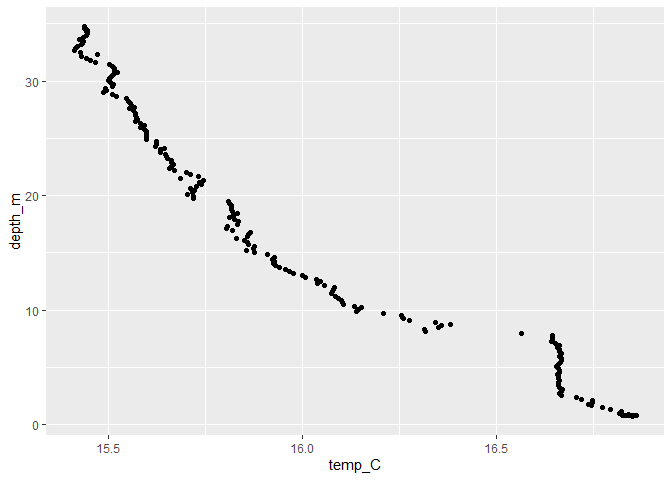
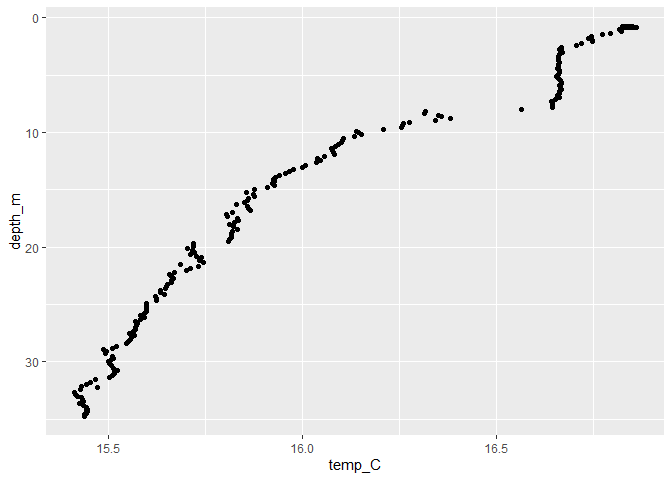
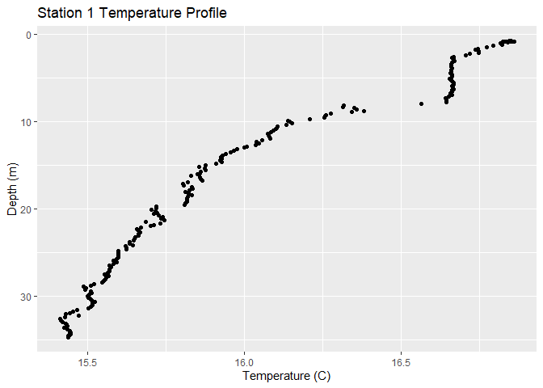
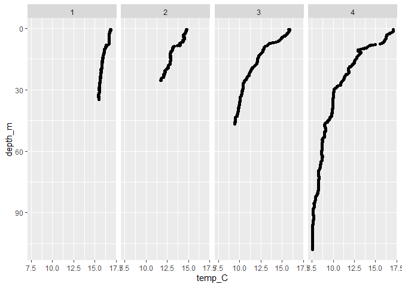
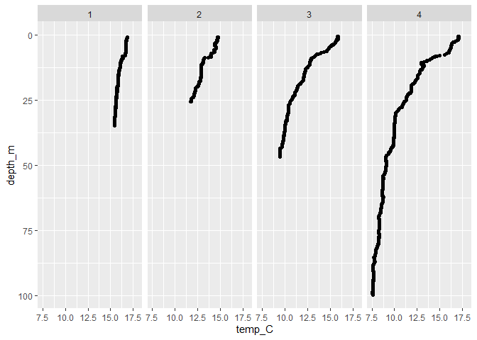
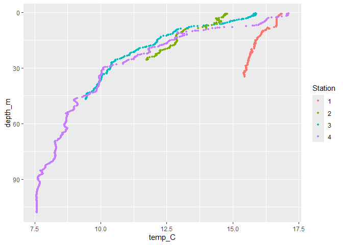
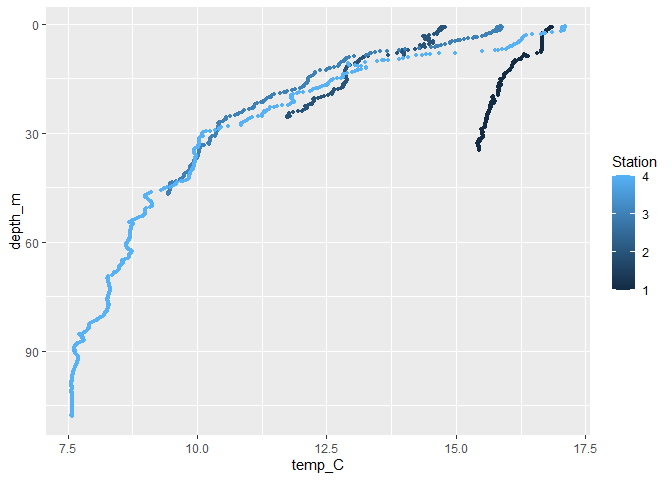

Visualizing DaRTS CTD data from a single cruise
================

In this lesson, we are going to explore CTD data from a single DaRTS
cruise.

We will learn how to:

2.  Import a spreadsheet into R as a data frame.
3.  Plot variables by depth in R using ggplot2.

## Loading your data into R

First we want to load the R libraries we’ll be using today:

``` r
library(tidyverse)
```

    ## ── Attaching core tidyverse packages ──────────────────────── tidyverse 2.0.0 ──
    ## ✔ dplyr     1.1.4     ✔ readr     2.1.5
    ## ✔ forcats   1.0.0     ✔ stringr   1.5.1
    ## ✔ ggplot2   3.5.2     ✔ tibble    3.3.0
    ## ✔ lubridate 1.9.4     ✔ tidyr     1.3.1
    ## ✔ purrr     1.1.0     
    ## ── Conflicts ────────────────────────────────────────── tidyverse_conflicts() ──
    ## ✖ dplyr::filter() masks stats::filter()
    ## ✖ dplyr::lag()    masks stats::lag()
    ## ℹ Use the conflicted package (<http://conflicted.r-lib.org/>) to force all conflicts to become errors

This loads all the functions we will need to load and plot our data.

Let’s try to read in the file we shared with you. The function to do
this is `read.csv`, and we need to provide the name of our data file,
including the path to the file if it is in a different location than
this markdown file.

**Example 1:** not including the file path

`data <- read.csv("DaRTS_SingleCruise_CTDdata.csv", header = TRUE)`

**Example 2:** including the path

In the below `"../"` indicates move up one directory

``` r
data <- read.csv("../DaRTS-data/DaRTS_SingleCruise_CTDdata.csv", header = TRUE)
```

You can see this object show up on the left-hand ‘Environment’ tab in R
studio. You can learn more about this object using a couple of different
commands. For example, to learn about what the structure of the object
is you can type use the function ‘str’

``` r
str(data)
```

    ## 'data.frame':    1258 obs. of  15 variables:
    ##  $ year            : int  2024 2024 2024 2024 2024 2024 2024 2024 2024 2024 ...
    ##  $ month           : int  9 9 9 9 9 9 9 9 9 9 ...
    ##  $ day             : int  5 5 5 5 5 5 5 5 5 5 ...
    ##  $ cruise          : int  1 1 1 1 1 1 1 1 1 1 ...
    ##  $ station         : int  1 1 1 1 1 1 1 1 1 1 ...
    ##  $ depth_m         : num  0.78 0.787 0.789 0.79 0.792 0.791 0.79 0.791 0.796 0.801 ...
    ##  $ temp_C          : num  16.8 16.8 16.8 16.8 16.8 ...
    ##  $ sal_PSU         : num  31.3 31.3 31.3 31.3 31.3 ...
    ##  $ density_kg_m.3  : num  22.7 22.7 22.7 22.7 22.7 ...
    ##  $ PAR             : num  1400 1700 1670 1790 1640 1660 1490 1560 1430 1550 ...
    ##  $ fluor_mg_m.3    : num  0.978 0.984 1.007 1.011 1.052 ...
    ##  $ turbidity_NTU   : num  1.16 1.15 1.15 1.15 1.15 ...
    ##  $ O2conc_umol_kg.1: num  200 201 201 201 202 ...
    ##  $ O2sat_percent   : num  81.7 81.8 81.8 81.8 82.3 ...
    ##  $ pH              : num  8.02 8.03 8.03 8.03 8.03 ...

Other functions you can use to learn about the data object are
“colnames” and “nrow”. Feel free to give those a try to see what they
do.

# Visualizing Data: Part 1

**Challenge 1:** Plot a temperature profile from Station 1.

Let’s think through the steps we’re going to need to do before we start:

1.  Select only the data from Station 1
2.  Plot temperature on the x-axis, depth on the y-axis

## Wrangling Data aka getting your data ready for plotting

We need to pull out all rows of data that correspond to Station 1. We
will do this using a process called *filtering*. We will use the
function `filter` from the package `dplyr` (part of the tinyverse). It
looks like this:

``` r
stn1 <- dplyr::filter(data, station == 1)
```

**What did we just do?** The double equals sign is a *conditional*, it’s
telling R to go through the data frame and identify rows where the
condition of equality is met for the specified variables (in this case,
where the station column equaled 1).

It can be good practice to check what you did worked - so let’s check
what this looks like (using code below, or could check the `stn1`
variable in the Environment):

``` r
head(stn1)
```

    ##   year month day cruise station depth_m  temp_C sal_PSU density_kg_m.3  PAR
    ## 1 2024     9   5      1       1   0.780 16.8495 31.3065        22.7164 1400
    ## 2 2024     9   5      1       1   0.787 16.8444 31.3016        22.7138 1700
    ## 3 2024     9   5      1       1   0.789 16.8368 31.3022        22.7160 1670
    ## 4 2024     9   5      1       1   0.790 16.8294 31.3028        22.7182 1790
    ## 5 2024     9   5      1       1   0.792 16.8240 31.3023        22.7190 1640
    ## 6 2024     9   5      1       1   0.791 16.8298 31.2936        22.7110 1660
    ##   fluor_mg_m.3 turbidity_NTU O2conc_umol_kg.1 O2sat_percent    pH
    ## 1       0.9783        1.1572          200.339        81.712 8.024
    ## 2       0.9838        1.1543          200.690        81.845 8.025
    ## 3       1.0066        1.1543          200.575        81.786 8.027
    ## 4       1.0112        1.1543          200.642        81.802 8.029
    ## 5       1.0515        1.1543          201.918        82.314 8.030
    ## 6       1.0506        1.1514          203.769        83.073 8.031

Now we are ready to plot our data.

**But what about filtering out the temperature and depth data?? Don’t we
need to do that first?** No!

When plotting, we can tell R which columns of our data frame we’d like
it to plot, and it will plot all the rows in the data frame for those
columns. Our data frame contains rows for all four stations. So if we
want to plot only one station, we need to filter out the station we want
first. Then we tell R to plot the columns we want from that filtered
data frame.

## Plotting Data

Time to plot! We’re going to use a package called `ggplot2`… we will go
into greater depth later about how exactly ggplot is working, for now,
here’s the code to plot a temperature profile:

``` r
ggplot(stn1, aes(x = temp_C, y = depth_m)) + geom_point()
```

<!-- -->

How does this look? Is there anything wrong with this plot?

In oceanography, we like to orient ocean data from the surface on the
top of the y axis and depth at the bottom of the y axis, so we need to
flip our plot (aka reverse our y axis) - note, part of programming is
learning the language to use:

``` r
ggplot(stn1, aes(x = temp_C, y = depth_m)) + 
  geom_point() + 
  scale_y_reverse()
```

<!-- -->

R has automatically named our axes using the data frame column names.
This is super handy for quick plotting, but often we want to relabel
them into something more informative:

``` r
ggplot(stn1, aes(x = temp_C, y = depth_m)) + 
  geom_point() + 
  scale_y_reverse() + 
  xlab('Temperature (C)') + 
  ylab('Depth (m)') + 
  ggtitle('Station 1 Temperature Profile')
```

<!-- -->

## Saving figures

If you want to save a figure, use `ggsave`:

``` r
ggsave('st1_temp_profile.png', width = 4, height = 6)
```

Although the nice thing about using notebooks and markdown is that you
don’t need to save your figures out - they are rendered within your
markdown or notebook file.

## Visualizing Data: Part 2

**Challenge 2:** Plot a temperature profile from all four stations.

Let’s think through the steps we’re going to need to do before we start:

In this case, we have a few options: \* Do we want four individual
plots, similar to what we just created? \* Do we want all the data shown
on one plot?

It probably depends the story you’re trying to tell, or what the data
looks like, or some other factor.

Let’s do both!

### Individual plots

Here, we do NOT need to redo what we did above for station 1 four times.
We can use a technique called `faceting`:

``` r
ggplot(data, aes(x = temp_C, y = depth_m)) +
  geom_point() + 
  facet_wrap(~station, ncol = 4) +
  scale_y_reverse()
```

<!-- -->
Note that you can specify the axis limits:

``` r
ggplot(data, aes(x = temp_C, y = depth_m)) +
  geom_point() + 
  facet_wrap(~station, ncol = 4) +
  ylim(100, 0) + xlim(7.5, 18)
```

    ## Warning: Removed 81 rows containing missing values or values outside the scale range
    ## (`geom_point()`).

<!-- -->

### Single plot

Here, we add an additional argument to the call to `aes`:

``` r
ggplot(data, aes(x = temp_C, y = depth_m, color = factor(station))) +
  geom_point(size = 1) + 
  scale_y_reverse() + 
  labs(color = 'Station')
```

<!-- -->

Note - let’s breakdown that `factor(station)` command:

*`factor(station)` is doing something to our station column… it’s
turning those numbers into factors. What is a factor? Factors are
categories i.e., they are discrete buckets, rather than continuous data.
So, because our stations can only be 1, 2, 3 or 4, they are factors,
rather than regular numbers, because if they were regular numbers, it
would imply we could have a station 1.1, 2.5, etc. * The conversion to
factors is important for how R considers the data. If R thinks the data
is a continuous number, it will color the dots differently - see example
below.

If you don’t do the conversion to factors:

``` r
ggplot(data, aes(x = temp_C, y = depth_m, color = station)) +
  geom_point(size = 1) + 
  scale_y_reverse() + 
  labs(color = 'Station')
```

<!-- -->

# Practice Questions

1.  Plot salinity, density and pH profiles for each station using
    faceting
2.  For each of the following variables, plot profiles for each station
    on one plot: PAR, fluorescence, turbidity and O2 percent saturation
    (i.e., one plot for PAR, with all four stations on the one plot,
    etc).

In both cases, be sure to label the axes appropriately (with the correct
units).

Bonus questions (Google is your friend):

1.  Can you change the color, shape and/or size of the dots in the facet
    plot?
2.  Can you change the color, shape and/or size of the dots in the
    single plot?
