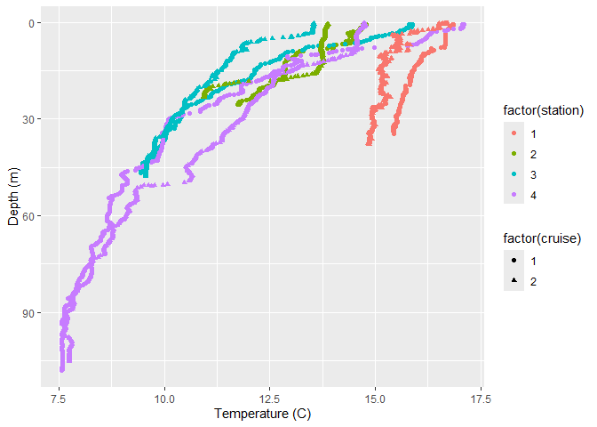
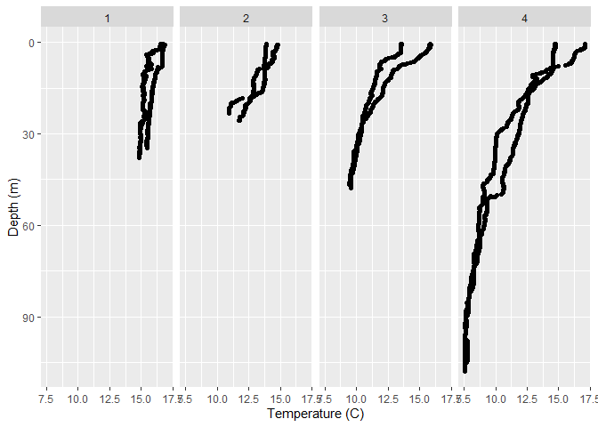
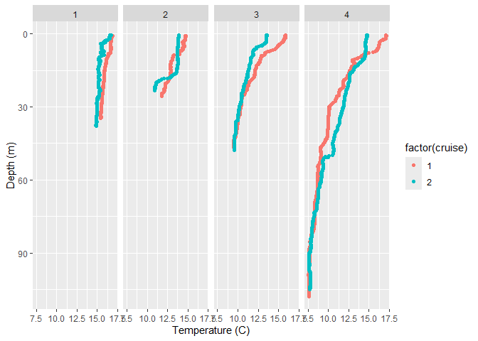
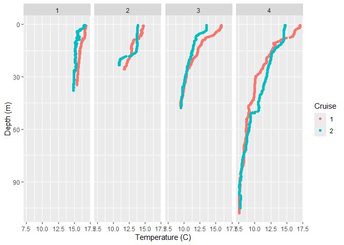
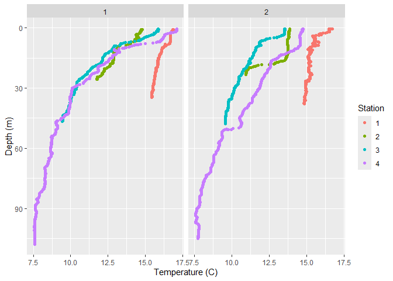

Visualizing DaRTS CTD data from two cruises
================

In the previous lesson we considered CTD data from one cruise - what
about two cruises?

We will learn how to:

1.  Plot profiles of CTD data for multiple cruises and stations.

## Loading your data into R

First we want to load the R libraries we’ll be using today:

``` r
library(tidyverse)
```

    ## ── Attaching core tidyverse packages ──────────────────────── tidyverse 2.0.0 ──
    ## ✔ dplyr     1.1.4     ✔ readr     2.1.5
    ## ✔ forcats   1.0.0     ✔ stringr   1.5.1
    ## ✔ ggplot2   3.5.2     ✔ tibble    3.3.0
    ## ✔ lubridate 1.9.4     ✔ tidyr     1.3.1
    ## ✔ purrr     1.1.0     
    ## ── Conflicts ────────────────────────────────────────── tidyverse_conflicts() ──
    ## ✖ dplyr::filter() masks stats::filter()
    ## ✖ dplyr::lag()    masks stats::lag()
    ## ℹ Use the conflicted package (<http://conflicted.r-lib.org/>) to force all conflicts to become errors

This loads all the functions we will need to load and plot our data.

Let’s try to read in the file we shared with you. The function to do
this is `read.csv`, and we need to provide the name of our data file,
including the path to the file if it is in a different location than
this markdown file.

**Example 1:** not including the file path

`data <- read.csv("DaRTS_TwoCruise_CTDdata.csv", header = TRUE)`

**Example 2:** including the path

In the below `"../"` indicates move up one directory

``` r
data <- read.csv("../DaRTS-data/DaRTS_TwoCruise_CTDdata.csv", header = TRUE)
```

# Visualizing Data

**Challenge 1:** Plot temperature profiles at all stations for both
cruises.

Let’s think about the different options we could use to plot the data:

1.  Plot everything on one graph
2.  Plot one graph for each station, and both cruises on each graph
3.  Plot one graph for each cruise, and all stations on each graph

Do we need to do any data wrangling this time? **No!** We need to have
access to ALL the stations and cruises.

## Plotting

### Single plot with everything

Here we could use marker shape to distinguish different cruises and
marker color to distinguish different stations. Note to do this, we need
to use factors.

``` r
ggplot(data, aes(x = temp_C, y = depth_m, shape = factor(cruise), colour = factor(station))) + 
  geom_point() + 
  scale_y_reverse() + 
  xlab('Temperature (C)') + 
  ylab('Depth (m)') 
```

<!-- -->
What do we think of this plot?

It’s a bit messy and difficult to tell what the different lines are.
Maybe one of the other options will be better!

### Individual plots for each station

Here, we can use faceting.

``` r
ggplot(data, aes(x = temp_C, y = depth_m)) + 
  geom_point() + 
  facet_wrap(~station, ncol = 4) +
  scale_y_reverse() + 
  xlab('Temperature (C)') + 
  ylab('Depth (m)') 
```

<!-- -->
This gives us one plot for each station, but what about plotting each
cruise in a different color?

``` r
ggplot(data, aes(x = temp_C, y = depth_m, colour=factor(cruise))) + 
  geom_point() + 
  facet_wrap(~station, ncol = 4) +
  scale_y_reverse() + 
  xlab('Temperature (C)') + 
  ylab('Depth (m)') 
```

<!-- -->
Finally, let’s give the legend title a better name:

``` r
ggplot(data, aes(x = temp_C, y = depth_m, colour=factor(cruise))) + 
  geom_point() + 
  facet_wrap(~station, ncol = 4) +
  scale_y_reverse() + 
  xlab('Temperature (C)') + 
  ylab('Depth (m)') +
  labs(color="Cruise")
```

<!-- -->
\### Individual plots for each cruise

Here, we can use faceting again. Let’s start with the final block of
code in the previous section, and adjust it for our needs here:

``` r
ggplot(data, aes(x = temp_C, y = depth_m, colour=factor(station))) + 
  geom_point() + 
  facet_wrap(~cruise, ncol = 2) +
  scale_y_reverse() + 
  xlab('Temperature (C)') + 
  ylab('Depth (m)') +
  labs(color="Station")
```

<!-- -->
Which figure is the best? It depends what you are trying to show! The
faceted plot with four plots (one per station) is really useful for
comparing differences *at* each station *between* cruises, whereas the
faceted plot with two plots (one per cruise) is really useful for
comparing differences *between* stations for each cruise.

# Practice Question

For each of the following variables, make either a four panel facet plot
(i.e., one panel per station) OR a two panel facet plot (i.e., one panel
per cruise) of profiles: salinity, density, pH profiles, PAR,
fluorescence, turbidity and O2 percent saturation.

You can create both sets of facet plots for some (or all!) of the
variables.
