Working with multi-year DaRTS Data
================

# Lab Outcomes

1.  Combine the discrete and CTD data into one data set
2.  Visualize the data in a few different ways.

We’ve seen how to visualize data from one cruise, but the value of the
DaRTS data collection is that the time series has going on for a long
time, giving us opportunities to ask lots of interesting questions.

So let’s begin!

# How to approach a computational research question

## 1. Start with a question

When starting a research project, we often start with a great question,
e.g.

**How does picoplankton concentration change with temperature?**

But, before we can even answer that question, we have to think about how
we are going to *wrangle* our data into a form that makes it *easy* to
answer that question.

In this case, we are going to have to combine data from two different
datasets: the discrete data and the CTD data from the DaRTS data.

There are multiple ways to merge the datasets depending on the exact
combination of variables you want e.g. do you want all the stations
and/or all the depths and/or only one station and/or multiple years,
etc.

To figure out the way to do the merge, we need to break down the process
into the most basic/small steps. This is good practice for any kind of
code development: breaking down your task into discrete, bitesize
bundles. Think about building a robot to make a sandwich. You couldn’t
just code “make a sandwich”, you’d need to break it down into steps,
like a recipe e.g. go to the cupboard, take out the bread, put it on the
table, etc. Some of those steps may seem obvious to you, but it wouldn’t
be to a robot.

## 2. ***How*** are you going to answer your question?

Here, we started with the question:

**How does picoplankton concentration change with temperature?**

Next, we need to think about ***how*** to answer this question
i.e. ***what form does our data need to be in to answer this
question?***

In the case of picoplankton concentration and temperature, we can
envision making a graph with picoplankton concentration on the x-axis,
and temperature on the y-axis. So we need to make a table of data where
we have columns with identifying information (e.g. cruise, date, station
number, depth), the picoplankton concentration and the temperature.
Then, from that data table (or `data frame` in R talk) we can plot our
data.

## 3. ***What*** general data formatting steps do you need to take?

We’ve decided we need a dataframe that includes some type of identifying
information, plus picoplankton concentration and temperature. ***What***
do we need to do to our data to get it into that form?

We need to match the discrete and CTD data based on key identifying
information. In this case, that information is:

1.  The cruise date (for the DaRTS data, the different cruises are
    identified by the date),
2.  The station number,
3.  Depth (depending on your exact end goal / question, you’ll need to
    think a bit carefully about how we want to match by depth).

## 4. **Make a step-by-step plan**

With the above information, we can make a step-by-step plan for the data
*wrangling* (or formatting) that we need to do. Sometimes one of these
steps ends up getting broken down into even more steps at a later point
when you realize something may not be as straightforward as you first
thought.

**Step-by-step plan:**

1.  Import CTD data from csv
2.  Import discrete data from csv
3.  Check and reformat dates in each dataset if necessary
4.  Check and reformat depths, and other columns in each dataset if
    necessary
5.  Combine (merge) the discrete and CTD data
6.  Make plot of picoplankton concentration vs temperature

Now we have our plan, we can start doing it!

# Importing the data sets

Our two data sets are saved as separate CSV files. You can located them
in our Google Classroom under “RLab Data”. You will need to download
them onto your local computer. We recommend placing them in a
subdirectory of this project labelled “data”. Let’s do this now if you
haven’t done so already.

To load these data into R, we will first need to load the libraries
required to load, manipulate and visualize our datasets.

    ## 
    ## Attaching package: 'dplyr'

    ## The following objects are masked from 'package:stats':
    ## 
    ##     filter, lag

    ## The following objects are masked from 'package:base':
    ## 
    ##     intersect, setdiff, setequal, union

    ## ── Attaching core tidyverse packages ──────────────────────── tidyverse 2.0.0 ──
    ## ✔ forcats   1.0.0     ✔ stringr   1.5.1
    ## ✔ lubridate 1.9.4     ✔ tibble    3.3.0
    ## ✔ purrr     1.1.0     ✔ tidyr     1.3.1
    ## ✔ readr     2.1.5     
    ## ── Conflicts ────────────────────────────────────────── tidyverse_conflicts() ──
    ## ✖ dplyr::filter() masks stats::filter()
    ## ✖ dplyr::lag()    masks stats::lag()
    ## ℹ Use the conflicted package (<http://conflicted.r-lib.org/>) to force all conflicts to become errors
    ## 
    ## Attaching package: 'kableExtra'
    ## 
    ## 
    ## The following object is masked from 'package:dplyr':
    ## 
    ##     group_rows

Ok, so now we are ready to import our data sets. We are going to load
each one into a separate data frame:

``` r
ctdData <- read.csv('data/DaRTS_CTD_data_2012-2024.csv')
discreteData <- read.csv('data/DaRTS_discrete_data_2012-2024.csv')
```

# Combining data sets

In our plan, we identified the important columns to merge on (cruise,
date and depth), and we decided we needed to check the format of the
date and depth data in each of our datasets.

## Dates

We know one of our key identifying pieces of information is date. So
let’s take a closer look at the dates in these dataframes.

First, let’s pull out just the dates column by referencing these columns
with the ‘\$’ sign:

``` r
# CTD Dates
ctdDates <- ctdData$Date

# and the discrete dates
discreteDates <- discreteData$Date
```

In the above two ways of pulling out the dates column we ended up with a
vector object.

What format are these dates in? You can check by manually opening the
two data frames (`ctdData` and `discreteData`) and looking at the Dates
column (i.e. double click on the data frames in the Environment Panel).
Or we can check using R:

``` r
ctdDates[1]
```

    ## [1] 20120911

What type of data is this? A number?

``` r
class(ctdDates[1])
```

    ## [1] "integer"

Numbers that do not contain decimal values have a data type as an
integer.

What about the discrete data dates?

``` r
discreteDates[1]
```

    ## [1] "9/11/12"

``` r
class(discreteDates[1])
```

    ## [1] "character"

A character can be a letter/number or a combination of letters and/or
numbers enclosed by quotes.

So in each case, the dates are different formats and different data
types. Let’s make them the same format and data type - this will make
things much easier for matching the discrete and CTD data.

Should we have our dates represented by numeric values? Or characters?

If we use characters, we need to be careful about knowing which part of
the date is the month, day and year: in the US it’s normal for dates to
be month/day/year, but in almost every other country it’s
day/month/year. This can lead to a lot of confusion when working
collaboratively with international participants, or even within a
research group if someone from Scotland joins a team of Americans! In
addition to the confusion about the day-month-year order, when we use
characters, it’s really difficult to do any date math e.g. counting how
many days between two dates.

This may make it seem like numbers are a better option - but this can
still lead to difficulties when wanting to do date math, e.g. if you
want to know how many days there are between dates that span multiple
months, you need to know how many days are in each of those months, and
if one of those months is February, are you in a leap year?

As you can see, we need to approach dates (& times) carefully. Most
programming languages have their own class of data for dates & times
(i.e. not numeric or characters). So a lot of those difficulties I
mentioned are dealt with behind the scenes by the different date math
functions that exist.

R deals with dates and times in a couple of different ways. We’re going
to use the [`lubridate`](https://lubridate.tidyverse.org/) package which
is part of the `tidyverse`. There’s [this great cheat
sheet](https://rawgit.com/rstudio/cheatsheets/master/lubridate.pdf)
which gives an overview of a lot of the functionality of the `lubridate`
package.

### Date reformatting

Let’s first load the `lubridate` package

``` r
library("lubridate")
```

Now, let’s deal with the CTD dates. We can use the `ymd` function to
tell `lubridate` that our date is currently a number stored in the
format yyyymmdd.

``` r
ctdDates <- lubridate::ymd(ctdData$Date)
```

What do these look like?

``` r
ctdDates[1]
```

    ## [1] "2012-09-11"

And what data type are they?

``` r
class(ctdDates)
```

    ## [1] "Date"

OK great - now what about the discrete dates? We can’t use the same
approach as above because our discrete dates are characters of the form
mm/dd/yyyy. But we can use something really similar:

``` r
discreteDates <- lubridate::mdy(discreteData$Date)
```

And let’s just check what these dates look like and their type:

``` r
discreteDates[1]
```

    ## [1] "2012-09-11"

``` r
class(discreteDates)
```

    ## [1] "Date"

Great - now we have nicely formatted dates that we can use later to
match our CTD and discrete data together. To make this task easier, we
want to include a new column in each of our data frames that contains
these newly formatted dates. To do this, we are going to use `dplyr`’s
`mutate` function. We used `filter` from `dplyr` last day. `dplyr` is
another part of the `tidyverse` that is for data frame manipulation.

### Adding new columns to a data frame with `mutate`

In the following, we are going to add a new column to our data frames
with these newly formatted dates. In each case, the new column will have
the name `Date`. Note if a column already exists with the name you are
assigning in the mutate function, the original column will be
overwritten. So here, we are overwriting the original dates, with the
newly formatted dates.

``` r
ctdData <- mutate(ctdData, Date = lubridate::ymd(ctdData$Date))

discreteData <- mutate(discreteData, Date = lubridate::mdy(discreteData$Date))
```

To do any type of data frame manipulations, you can use *pipes*. Pipes
are a recent addition to R. They let you take the output of one function
and send it directly to the next, which is useful when you need to do
many things to the same dataset. Pipe have two symbols to choose from,
the symbol `%>%` or `|>`. We’ll make full use of pipes later, but to add
the dates column to the ctdData data frame using pipes you would do:

``` r
ctdData <- ctdData %>% mutate(Date = lubridate::ymd(ctdData$Date))
```

This is equivalent to
`ctdData <- mutate(ctdData, Date = ymd(ctdData$Date))`.

#### Tip for working with dates

In the first data frame, dates were conveyed as three separate columns
for the year, month and day, as well as one column for the combined
date. This is really useful when you start to do your analysis and you
want to look at the data from one year, or one month or even one day!
Let’s do that now for our two large dataframes

``` r
ctdData <- ctdData %>% 
  mutate(year = year(ctdData$Date),
         month = month(ctdData$Date),
         day = day(ctdData$Date))

discreteData <- discreteData %>% 
  mutate(year = year(discreteData$Date),
         month = month(discreteData$Date),
         day = day(discreteData$Date))
```

The other useful way to represent the date is day of year, it can be
particularly useful for certain analyses. Let’s also include a day of
year column

``` r
ctdData <- ctdData %>% 
  mutate(doy = yday(ctdData$Date))

discreteData <- discreteData %>% 
  mutate(doy = yday(discreteData$Date))
```

## Depths

The depth is another key piece of identifying information for merging
our datasets.

What do the depths look like for each dataset?

Let’s print out the first 10 depths of the CTD data:

``` r
ctdData$Depth_m[1:10]
```

    ##  [1] 1.363 1.346 1.345 1.354 1.360 1.362 1.355 1.342 1.342 1.356

And of the discrete data:

``` r
discreteData$Depth[1:10]
```

    ##  [1] "2"  "10" "30" "2"  "10" "40" "2"  "10" "40" "2"

The discrete measurements are at well defined depth intervals, but the
CTD measurements were continuous - so how are we going to match these?

We need to make some assumption - here, we’re going to *bin* the CTD
data to the nearest meter. That is, we are going to take all the data
within a depth interval (also known as a bin), and take the mean value
of the data within that bin. Here, our depth interval will be 1 m,
i.e. we’ll bin our CTD data such that we end up with data at depths of
`1, 2, 3, 4, 5, ...` meters.

### Binning using `group_by` and `summarize`

This process of binning data is an example of the split-apply-combine
paradigm: split the data into groups, apply some analysis to each group,
and then combine the results. Many data analysis tasks can be approached
using this technique.

In the case of binning:

- split the data into groups: we’re splitting our data into groups based
  on the depth.
- apply some analysis to each group: we’re taking the mean of the data
  in each of our groups
- combine the results: we’re putting all the binned data back into a new
  dataframe.

Here, we’re going to make use of pipes too.

First, we need to round our depths to the nearest meter, then we can bin
them.

``` r
ctdData <- ctdData %>% mutate(Depth = round(ctdData$Depth_m))
```

Now for the binning.

``` r
ctdDataBinned <- ctdData %>% 
  group_by(Depth) %>% 
  summarize_all(mean)
```

    ## Warning: There were 336 warnings in `summarise()`.
    ## The first warning was:
    ## ℹ In argument: `Station = (function (x, ...) ...`.
    ## ℹ In group 1: `Depth = 0`.
    ## Caused by warning in `mean.default()`:
    ## ! argument is not numeric or logical: returning NA
    ## ℹ Run `dplyr::last_dplyr_warnings()` to see the 335 remaining warnings.

Let’s take a look at our final dataframe, we’ll open it from the
Environment Pane. On first glance, this looks like it’s done what we
want - we’ve only got depths of rounded meters. But, if we look at the
other columns, things don’t look quite right. The stations are no longer
sensible station numbers, and there’s quite a lot of data missing.

What we’ve actually done is calculated the mean profile for all the CTD
data together, *rather than the mean profile for the CTD data at every
station on every cruise.* So we need to split our data using more
criteria. Also, when we calculated the mean, our missing data got in the
way. We need to tell R to ignore the missing data, and just calculate
the mean on the data that are there.

``` r
ctdDataBinned <- ctdData %>% 
  group_by(Date, Station, Depth) %>% 
  summarize_all(mean, na.rm = TRUE)
```

    ## Warning: There were 31666 warnings in `summarise()`.
    ## The first warning was:
    ## ℹ In argument: `pH = (function (x, ...) ...`.
    ## ℹ In group 1: `Date = 2012-09-11`, `Station = "1"`, `Depth = 1`.
    ## Caused by warning in `mean.default()`:
    ## ! argument is not numeric or logical: returning NA
    ## ℹ Run `dplyr::last_dplyr_warnings()` to see the 31665 remaining warnings.

## Merging the discrete and CTD data

Now we’ve got dates & depths in the same format in our discrete and CTD
datasets, we can merge them together.

Dataframe merging is a common task in many data science applications,
and there is some terminology involved to describe the different ways
you can merge the dataframes.

### Dataframe merging approaches

Mutating joins allow you to combine variables from multiple tables.
There are four types of mutating join, which differ in their behaviour
when a match is not found. We’ll illustrate each with an example. Let’s
start by making two dataframes:

    ##   x y
    ## 1 1 2
    ## 2 2 1

<table class="table" style="width: auto !important; margin-left: auto; margin-right: auto;">

<thead>

<tr>

<th style="text-align:right;">

x
</th>

<th style="text-align:right;">

y
</th>

</tr>

</thead>

<tbody>

<tr>

<td style="text-align:right;">

1
</td>

<td style="text-align:right;">

2
</td>

</tr>

<tr>

<td style="text-align:right;">

2
</td>

<td style="text-align:right;">

1
</td>

</tr>

</tbody>

</table>

``` r
df2 <- data.frame(x = c(3, 1), a = 10, b = "a")
df2 %>% knitr::kable() %>% kable_styling(full_width = FALSE)
```

<table class="table" style="width: auto !important; margin-left: auto; margin-right: auto;">

<thead>

<tr>

<th style="text-align:right;">

x
</th>

<th style="text-align:right;">

a
</th>

<th style="text-align:left;">

b
</th>

</tr>

</thead>

<tbody>

<tr>

<td style="text-align:right;">

3
</td>

<td style="text-align:right;">

10
</td>

<td style="text-align:left;">

a
</td>

</tr>

<tr>

<td style="text-align:right;">

1
</td>

<td style="text-align:right;">

10
</td>

<td style="text-align:left;">

a
</td>

</tr>

</tbody>

</table>

#### `inner_join(df1, df2)`

Only includes observations that match in both `df1` and `df2`.

``` r
df_innerjoin <- df1 %>% inner_join(df2)
```

    ## Joining with `by = join_by(x)`

``` r
df_innerjoin  %>%  knitr::kable() %>% kable_styling(full_width = FALSE)
```

<table class="table" style="width: auto !important; margin-left: auto; margin-right: auto;">

<thead>

<tr>

<th style="text-align:right;">

x
</th>

<th style="text-align:right;">

y
</th>

<th style="text-align:right;">

a
</th>

<th style="text-align:left;">

b
</th>

</tr>

</thead>

<tbody>

<tr>

<td style="text-align:right;">

1
</td>

<td style="text-align:right;">

2
</td>

<td style="text-align:right;">

10
</td>

<td style="text-align:left;">

a
</td>

</tr>

</tbody>

</table>

Here, R was clever, and merged on the common column between the two
dataframes.

#### `left_join(df1, df2)`

Includes all observations in `df1`, regardless of whether they match or
not. This is the most commonly used join because it ensures that you
don’t lose observations from your primary table.

``` r
df_leftjoin <- df1 %>% left_join(df2)
```

    ## Joining with `by = join_by(x)`

``` r
df_leftjoin  %>%  knitr::kable() %>% kable_styling(full_width = FALSE)
```

<table class="table" style="width: auto !important; margin-left: auto; margin-right: auto;">

<thead>

<tr>

<th style="text-align:right;">

x
</th>

<th style="text-align:right;">

y
</th>

<th style="text-align:right;">

a
</th>

<th style="text-align:left;">

b
</th>

</tr>

</thead>

<tbody>

<tr>

<td style="text-align:right;">

1
</td>

<td style="text-align:right;">

2
</td>

<td style="text-align:right;">

10
</td>

<td style="text-align:left;">

a
</td>

</tr>

<tr>

<td style="text-align:right;">

2
</td>

<td style="text-align:right;">

1
</td>

<td style="text-align:right;">

NA
</td>

<td style="text-align:left;">

NA
</td>

</tr>

</tbody>

</table>

#### `right_join(df1, df2)`

Includes all observations in `df2`. It’s equivalent to
`left_join(df2, df1)`, but the columns and rows will be ordered
differently.

``` r
df_rightjoin <- df1 %>% right_join(df2)
```

    ## Joining with `by = join_by(x)`

``` r
df_rightjoin  %>%  knitr::kable() %>% kable_styling(full_width = FALSE)
```

<table class="table" style="width: auto !important; margin-left: auto; margin-right: auto;">

<thead>

<tr>

<th style="text-align:right;">

x
</th>

<th style="text-align:right;">

y
</th>

<th style="text-align:right;">

a
</th>

<th style="text-align:left;">

b
</th>

</tr>

</thead>

<tbody>

<tr>

<td style="text-align:right;">

1
</td>

<td style="text-align:right;">

2
</td>

<td style="text-align:right;">

10
</td>

<td style="text-align:left;">

a
</td>

</tr>

<tr>

<td style="text-align:right;">

3
</td>

<td style="text-align:right;">

NA
</td>

<td style="text-align:right;">

10
</td>

<td style="text-align:left;">

a
</td>

</tr>

</tbody>

</table>

In this case, we called `df1` first, so it’s columns are listed first in
the merged dataframe.

``` r
df2_leftjoin <- df2 %>% left_join(df1)
```

    ## Joining with `by = join_by(x)`

``` r
df2_leftjoin  %>%  knitr::kable() %>% kable_styling(full_width = FALSE)
```

<table class="table" style="width: auto !important; margin-left: auto; margin-right: auto;">

<thead>

<tr>

<th style="text-align:right;">

x
</th>

<th style="text-align:right;">

a
</th>

<th style="text-align:left;">

b
</th>

<th style="text-align:right;">

y
</th>

</tr>

</thead>

<tbody>

<tr>

<td style="text-align:right;">

3
</td>

<td style="text-align:right;">

10
</td>

<td style="text-align:left;">

a
</td>

<td style="text-align:right;">

NA
</td>

</tr>

<tr>

<td style="text-align:right;">

1
</td>

<td style="text-align:right;">

10
</td>

<td style="text-align:left;">

a
</td>

<td style="text-align:right;">

2
</td>

</tr>

</tbody>

</table>

In this case, `df2` was listed first, so it’s columns are first in the
merged dataframe.

#### `full_join()`

Includes all observations from `df1` and `df2`.

``` r
df_fulljoin <- df1 %>% full_join(df2)
```

    ## Joining with `by = join_by(x)`

``` r
df_fulljoin  %>%  knitr::kable() %>% kable_styling(full_width = FALSE)
```

<table class="table" style="width: auto !important; margin-left: auto; margin-right: auto;">

<thead>

<tr>

<th style="text-align:right;">

x
</th>

<th style="text-align:right;">

y
</th>

<th style="text-align:right;">

a
</th>

<th style="text-align:left;">

b
</th>

</tr>

</thead>

<tbody>

<tr>

<td style="text-align:right;">

1
</td>

<td style="text-align:right;">

2
</td>

<td style="text-align:right;">

10
</td>

<td style="text-align:left;">

a
</td>

</tr>

<tr>

<td style="text-align:right;">

2
</td>

<td style="text-align:right;">

1
</td>

<td style="text-align:right;">

NA
</td>

<td style="text-align:left;">

NA
</td>

</tr>

<tr>

<td style="text-align:right;">

3
</td>

<td style="text-align:right;">

NA
</td>

<td style="text-align:right;">

10
</td>

<td style="text-align:left;">

a
</td>

</tr>

</tbody>

</table>

The left, right and full joins are collectively know as **outer joins**.
When a row doesn’t match in an outer join, the new variables are filled
in with missing values.

### Back to the discrete and CTD data

What type of join do we want to do here?

Ultimately, we want to look at picoplankton and temperature data, so
we’re only interested in places were there are data in both those
columns: so that might imply an `inner_join`. **But** we are merging the
*whole* of the discrete dataset (not just the picoplankton) and the
*whole* of the binned CTD dataset (not just the temperature). **And** we
are merging on date, depth and station. Thus, we want to include *all
the observations* from each dataset, then filter out the data we’re
interested in (e.g. temperature and picoplankton concentration). To
include all the observations, we need to do a full join:

``` r
discreteData$Station <- as.character(discreteData$Station)
discreteData$Depth <- as.numeric(discreteData$Depth)
```

    ## Warning: NAs introduced by coercion

``` r
combinedData <- ctdDataBinned %>%
  full_join(discreteData)
```

    ## Joining with `by = join_by(Date, Station, Depth, pH, year, month, day, doy)`

**Final step is to save our new dataframe as a CSV file.** Then you can
use this dataset to answer your own questions without having to redo the
whole lab.

``` r
write.csv(combinedData,"data/DaRTS_combined_data.csv")
```

# Visualizing Datasets

Now we’ve merged our data - let’s take a look at it!

The question we posed at the start of the lab was

**How does picoplankton concentration change with temperature?**

One way to answer this question is to look at a plot of one against the
other:

``` r
combinedData |> colnames()
```

    ##  [1] "Date"                        "Station"                    
    ##  [3] "Depth"                       "Depth_m"                    
    ##  [5] "Conductivity"                "Temperature_C"              
    ##  [7] "Salinity_PSU"                "Density"                    
    ##  [9] "PAR.Irradiance"              "Fluorescence"               
    ## [11] "TurbidityNTU"                "BeamC"                      
    ## [13] "O2Conc"                      "O2Saturation"               
    ## [15] "pH"                          "X"                          
    ## [17] "X.1"                         "X.2"                        
    ## [19] "X.3"                         "X.4"                        
    ## [21] "X.5"                         "X.6"                        
    ## [23] "X.7"                         "X.8"                        
    ## [25] "X.9"                         "X.10"                       
    ## [27] "year"                        "month"                      
    ## [29] "day"                         "doy"                        
    ## [31] "Cruise"                      "Lat"                        
    ## [33] "Long"                        "Alk"                        
    ## [35] "SiO4_uM"                     "NO3.2_uM"                   
    ## [37] "PO4_uM"                      "NH4_uM"                     
    ## [39] "Pico_Plankton_cells_per_ml"  "Bacteria_cells_per_ml"      
    ## [41] "Virus_per_ml"                "Total_Chl_ug_per_l"         
    ## [43] "Chl_less_than_20um_ug_per_l" "Chl_less_than_3um_ug_per_l" 
    ## [45] "Flowcam_Biomass"             "cyanobacteria_per_ml"       
    ## [47] "picoeukaryotes_per_ml"       "noeukaryotes_per_ml"

``` r
ggplot(data = combinedData,
       aes(x=Pico_Plankton_cells_per_ml , y = Temperature_C)) +
  geom_point()
```

    ## Warning: Removed 15859 rows containing missing values or values outside the scale range
    ## (`geom_point()`).

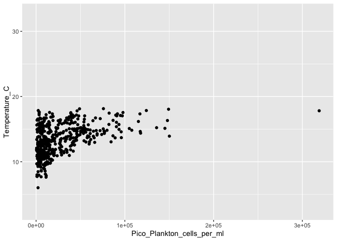<!-- -->

There are a lot of data bunched up together at the low picoplankton cell
counts, and not so much at the higher concentrations. This kind of
distribution is very common in the natural world. When analysing data
with this type of distribution, we look at it on a log scale:

``` r
ggplot(data = combinedData,
       aes(x=Pico_Plankton_cells_per_ml, y = Temperature_C)) +
  geom_point() +
  scale_x_log10()
```

    ## Warning: Removed 15859 rows containing missing values or values outside the scale range
    ## (`geom_point()`).

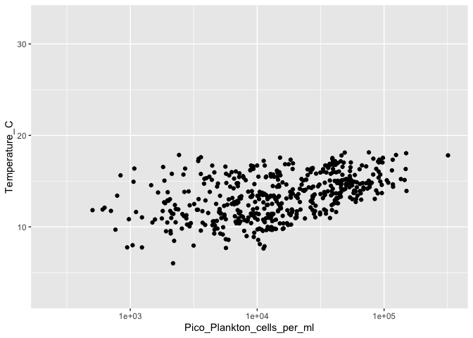<!-- -->

Here, we’ve got data more normally distributed across our x and y axes.

In the next lab we’re going to go over how to quantify this kind of
relationship using correlations and linear regressions - so we will
revisit this. But for now, let’s look at visualizing some of the data in
a different way.

## Visualizing change

Often we want to visualize how a variable has changed over time, be that
during one year, at different stations, etc. Here, we’re going to make a
few plots showing change over different parameters.

### How has surface picoplankton concentration changed over the time series?

We need to pull out (i.e. *filter*) the surface measurements for each
picoplankton.

The surface discrete measurements were always taken at 2 m, so we need
to filter our dataframe for depth values of 2.

``` r
surfaceData <- combinedData %>%
  filter(Depth == 2)
```

And now we can plot the data

``` r
ggplot(surfaceData, aes(x=Date, y= Pico_Plankton_cells_per_ml)) +
  geom_point()
```

    ## Warning: Removed 131 rows containing missing values or values outside the scale range
    ## (`geom_point()`).

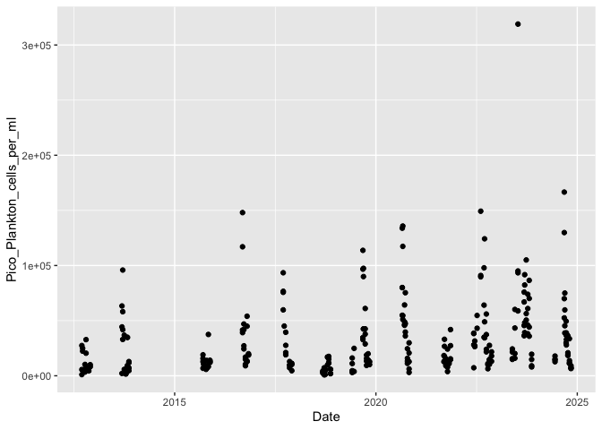<!-- -->

It’s a bit hard to tell what is going on here.

How can we make this easier to see what’s happening? Well, it depends on
what our exact question is e.g. 

#### 1) What is the overall change year-on-year?

Here, we want to group the data by year. Let’s put year on the x-axis:

``` r
ggplot(surfaceData, 
       aes(x=year, y= Pico_Plankton_cells_per_ml)) +
  geom_point()
```

    ## Warning: Removed 131 rows containing missing values or values outside the scale range
    ## (`geom_point()`).

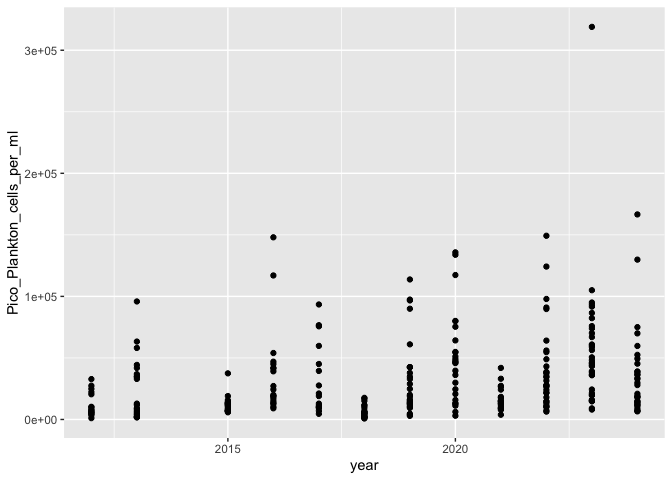<!-- -->

This still isn’t great at looking at the year-on-year change. What we
can do is create a boxplot for every year to show the distribution in
each year. Here, we want to treat the year as a factor, rather than a
regular number:

``` r
ggplot(surfaceData, 
       aes(x=factor(year), y= Pico_Plankton_cells_per_ml)) +
  geom_boxplot()
```

    ## Warning: Removed 131 rows containing non-finite outside the scale range
    ## (`stat_boxplot()`).

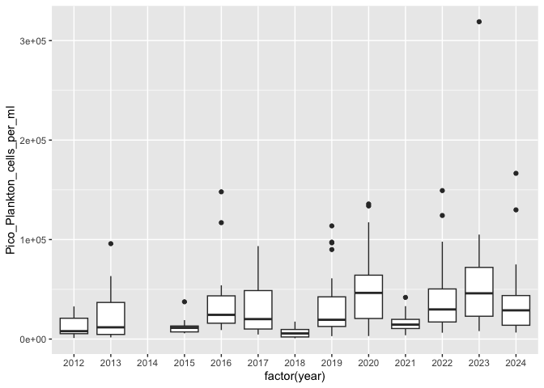<!-- -->

##### Boxplot explanation

The following diagram shows what the different parts of a boxplot made
with `geom_boxplot()` represent. Note, the convention for the box is
consistent, but often different programming languages, software, or even
research field, have different conventions for what the whiskers
represent.

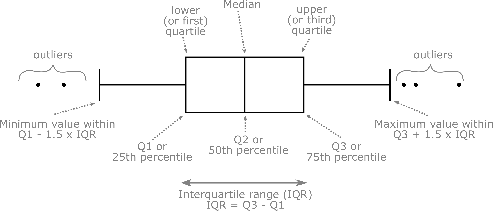<!-- -->

#### 2) What is the mean change within a year?

In this case, if we plot the data with day of year on the x-axis, then
we can see the yearly variation

``` r
ggplot(surfaceData, aes(x=doy, y= Pico_Plankton_cells_per_ml)) +
  geom_point()
```

    ## Warning: Removed 131 rows containing missing values or values outside the scale range
    ## (`geom_point()`).

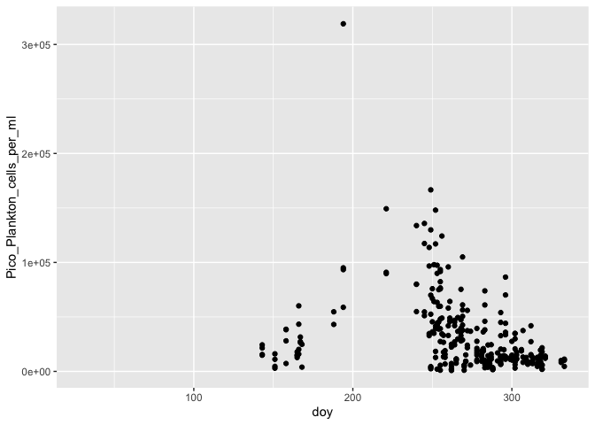<!-- -->

Let’s change the x-limits:

``` r
ggplot(surfaceData, aes(x=doy, y= Pico_Plankton_cells_per_ml)) +
  geom_point() +
  xlim(245,325)
```

    ## Warning: Removed 174 rows containing missing values or values outside the scale range
    ## (`geom_point()`).

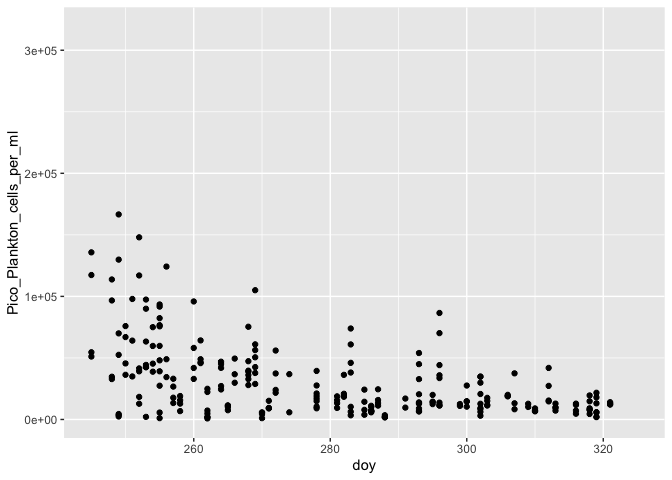<!-- -->

The final step is to calculate and plot the mean seasonal cycle. Note,
the following step will give lots of warnings because the latitude and
longitude data are stored as characters, not numbers, so when R tries to
calculate the mean of those columns, it can’t and so assigns the value
`NA` to those columns. However, it still can for all the other columns.

``` r
surfaceData %>% group_by(doy) %>%
  summarize_all(mean) %>%
  ggplot(aes(x=doy, y= Pico_Plankton_cells_per_ml)) +
  geom_point() +
  xlim(245,325)
```

    ## Warning: There were 368 warnings in `summarise()`.
    ## The first warning was:
    ## ℹ In argument: `Station = (function (x, ...) ...`.
    ## ℹ In group 1: `doy = 29`.
    ## Caused by warning in `mean.default()`:
    ## ! argument is not numeric or logical: returning NA
    ## ℹ Run `dplyr::last_dplyr_warnings()` to see the 367 remaining warnings.

    ## Warning: Removed 62 rows containing missing values or values outside the scale range
    ## (`geom_point()`).

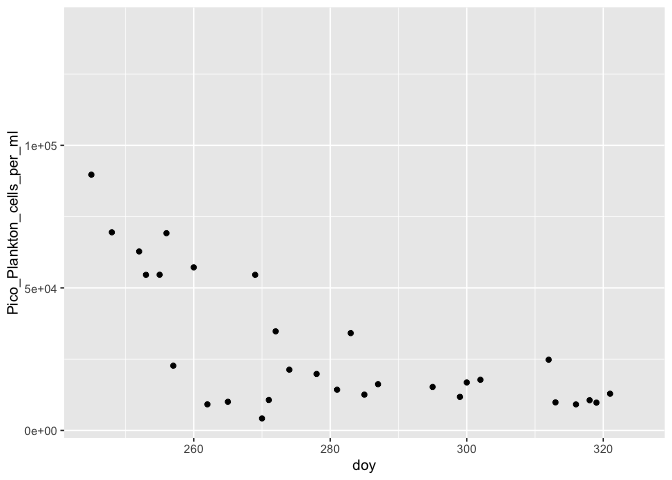<!-- -->

#### 3) What is the seasonal change at Station 1?

Here we need to filter for station 1 data only, then plot by day of year
as in the previous example.

``` r
surfaceData %>% filter(Station == 1) %>%
  ggplot(aes(x=doy, y= Pico_Plankton_cells_per_ml)) +
  geom_point() +
  xlim(245,325)
```

    ## Warning: Removed 43 rows containing missing values or values outside the scale range
    ## (`geom_point()`).

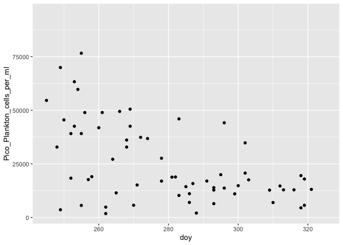<!-- -->

Let’s color each point by the year.

``` r
surfaceData %>% filter(Station == 1) %>%
  ggplot(aes(x=doy, y= Pico_Plankton_cells_per_ml,
             color = factor(year))) +
  geom_point() +
  geom_line() +
  xlim(245,325)
```

    ## Warning: Removed 43 rows containing missing values or values outside the scale range
    ## (`geom_point()`).

    ## Warning: Removed 32 rows containing missing values or values outside the scale range
    ## (`geom_line()`).

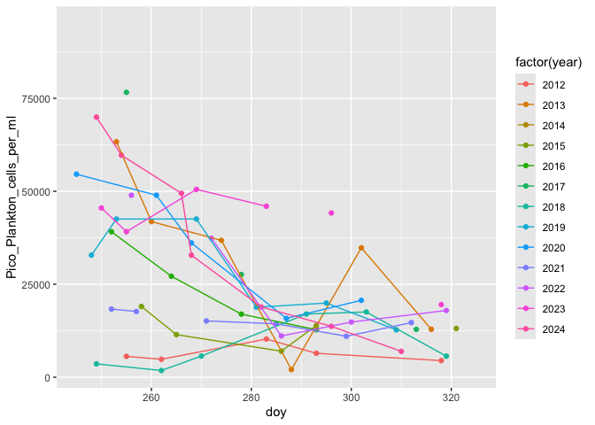<!-- -->

#### 4) What is the seasonal change at all stations during 2016?

``` r
surfaceData %>% filter(year == 2016) %>%
  ggplot(aes(x=doy, y=Pico_Plankton_cells_per_ml,
             color = factor(Station))) +
  geom_point() +
  geom_line()
```

    ## Warning: Removed 1 row containing missing values or values outside the scale range
    ## (`geom_point()`).

    ## Warning: Removed 1 row containing missing values or values outside the scale range
    ## (`geom_line()`).

<!-- -->

Another way to plot this is with a contour plot

``` r
surfaceData %>% filter(year == 2016) %>% 
  drop_na(Pico_Plankton_cells_per_ml) %>%
  ggplot(aes(x=doy, y= Station,
             z = Pico_Plankton_cells_per_ml)) +
  geom_contour_filled() +
  geom_point() +
  labs(title = 'picoplankton conc (cells/ml)')
```

    ## Warning: `stat_contour()`: Zero contours were generated

    ## Warning in min(x): no non-missing arguments to min; returning Inf

    ## Warning in max(x): no non-missing arguments to max; returning -Inf

    ## Warning: `stat_contour()`: Zero contours were generated

    ## Warning in min(x): no non-missing arguments to min; returning Inf

    ## Warning in max(x): no non-missing arguments to max; returning -Inf

    ## Warning: `stat_contour()`: Zero contours were generated

    ## Warning in min(x): no non-missing arguments to min; returning Inf

    ## Warning in max(x): no non-missing arguments to max; returning -Inf

    ## Warning: `stat_contour()`: Zero contours were generated

    ## Warning in min(x): no non-missing arguments to min; returning Inf

    ## Warning in max(x): no non-missing arguments to max; returning -Inf

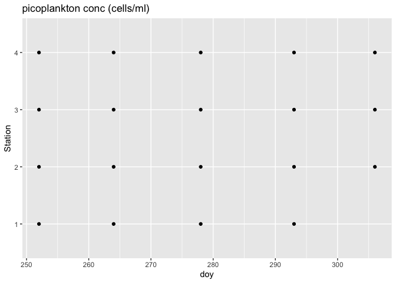<!-- -->
\## Assignment: Digging into temperature

### Lab 3: Assignment Plots

Using the historical DaRTS data, answer the following questions through
construction of plots in R.

1.  What is the overall change in temperature year-on-year? (Hint: plot
    the temperature distribution for each year as a boxplot)
2.  What is the mean seasonal temperature cycle within a year?
3.  What is the seasonal change at Station 1? Show each year in a
    different color.
4.  What is the seasonal change in temperature at all stations during
    2016?
